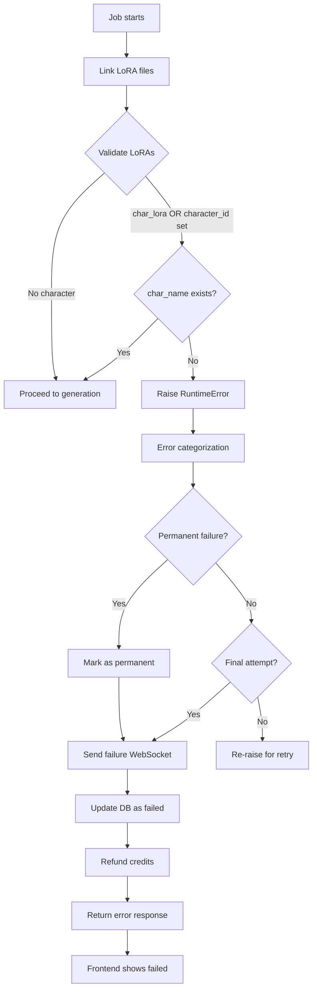

# Missing LoRA Validation Fix

## Problem

When a user selected a character or style but the corresponding LoRA file was missing or invalid, the system would **bypass the missing LoRA and proceed with image generation** instead of failing with a clear error message.

This resulted in:
1. ❌ Images generated without the selected character/style
2. ❌ User confusion (they selected a character but didn't get it)
3. ❌ Wasted compute resources and credits
4. ❌ Poor user experience

### Root Cause

The earlier fix for the "HTTP 400 ComfyUI validation error" implemented an **auto-bypass mechanism** in `workflow_patcher.py` that would bypass CharacterLora and StyleLora nodes when the LoRA files were `None`. This was correct for **intentionally empty** selections (e.g., style-only jobs), but **incorrect** when a user **selected** a character/style and the file was missing.

## Solution

Added **early validation** in `comfyui_app.py` to distinguish between:
1. ✅ **Intentionally no character/style** → `character_id`/`style_id` is `None` → Bypass is OK
2. ❌ **Character/style selected but file missing** → `character_id`/`style_id` is set but file doesn't exist → **FAIL immediately**

### Implementation

**File**: `modal_apps/inference/comfyui_app.py`

**Location**: Right after LoRA linking (lines 1226-1262)

```python
# CRITICAL VALIDATION: Check if LoRA files exist when they should
# We need to check BOTH the input_data AND the prepared payload to catch all edge cases:
# 1. Character/style ID in input_data but LoRA path is None (database has NULL lora_path)
# 2. Character/style LoRA path provided but file doesn't exist on disk

character_id_from_input = input_data.get("character_id")
style_id_from_input = input_data.get("style_id")

# Validate character LoRA
# Check if character was intended (either ID provided OR lora path provided in prepared payload)
if character_id_from_input or char_lora:
    # If we have a character ID or path, verify the file exists
    if char_name is None:
        # File is missing or invalid
        error_msg = f"Character file is missing or invalid"
        if character_id_from_input:
            error_msg += f" (Character ID: {character_id_from_input})"
        if char_lora:
            error_msg += f" (Path: {char_lora})"
        error_msg += ". The character may have been deleted or the file is corrupted."
        raise RuntimeError(error_msg)

# Validate style LoRA
# Check if style was intended (either ID provided OR lora path provided in prepared payload)
if style_id_from_input or style_lora:
    # If we have a style ID or path, verify the file exists
    if style_name is None:
        # File is missing or invalid
        error_msg = f"Style file is missing or invalid"
        if style_id_from_input:
            error_msg += f" (Style ID: {style_id_from_input})"
        if style_lora:
            error_msg += f" (Path: {style_lora})"
        error_msg += ". The style may have been deleted or the file is corrupted."
        raise RuntimeError(error_msg)

print(f"✅ LoRA validation passed - Character: {char_name or 'None (style-only)'}, Style: {style_name or 'None (character-only)'}")
```

**Key Features**:
1. **Dual Check**: Validates BOTH the `character_id`/`style_id` from request AND the `char_lora`/`style_lora` paths from prepared payload
2. **Catches Both Scenarios**:
   - User selected character but database `lora_path` is NULL
   - User selected character, path exists in DB, but file missing from S3
3. **Detailed Error Messages**: Shows both the ID and the path (if available) to help with debugging

### Error Categorization

Added specific error categorization for missing LoRA files (lines 1891-1902):

```python
# Missing LoRA file errors (from our validation) - PERMANENT FAILURE, don't retry
elif "file is missing or invalid" in error_str:
    error_details["category"] = "missing_lora"
    error_details["is_permanent_failure"] = True  # Mark as permanent - should not be retried
    error_details["error_key"] = "errors.validation.missingStyleOrCharacter"
    # Extract more specific message from the error
    if "character" in error_str:
        error_details["suggestion"] = "The selected character is no longer available. Please select a different character."
    elif "style" in error_str:
        error_details["suggestion"] = "The selected style is no longer available. Please select a different style."
    else:
        error_details["suggestion"] = "The requested style or character is no longer available. Please try again or select a different option."
```

**Critical**: Added `is_permanent_failure` flag to prevent retries on validation errors!

### Retry Logic Update

Updated retry logic (lines 2091-2104) to check for permanent failures:

```python
# Re-raise the exception ONLY if not final attempt AND not a permanent failure
# Permanent failures (like missing LoRA files) should never be retried
# On final attempt OR permanent failure, return error response instead of raising
is_permanent_failure = error_details.get("is_permanent_failure", False)

if not is_final_attempt and not is_permanent_failure:
    print(f"🔄 Re-raising exception to allow Modal container retry (attempt {current_attempt + 1}/{max_retries})...")
    raise
else:
    if is_permanent_failure:
        print(f"🚨 Permanent failure detected (e.g., missing LoRA file) - not retrying")
    else:
        print(f"🚨 Final attempt failed - returning error response instead of raising")
    print(f"📤 Sent final completion message for job {job_id}")
```

**Key Change**: Validation errors are treated as permanent failures and fail immediately without retries.

## Behavior After Fix

### Scenario 1: Style-only job (no character selected)
- `character_id = None`
- `char_lora = None`
- `char_name = None`
- ✅ **Validation passes** → CharacterLora node is bypassed → Generation proceeds

### Scenario 2: Character selected, file exists
- `character_id = "abc123"`
- `char_lora = "/data/loras/character_abc123.safetensors"`
- `char_name = "job_id__character_abc123.safetensors"`
- ✅ **Validation passes** → CharacterLora uses the file → Generation proceeds

### Scenario 3: Character selected, file missing (THE FIX)
- `character_id = "abc123"` (or `None` if not in request, but `char_lora` is set)
- `char_lora = "/data/loras/character_abc123.safetensors"`
- `char_name = None` (file doesn't exist)
- ❌ **Validation FAILS** → RuntimeError raised
- 🚨 **Permanent failure detected** → NOT retried
- ⏹️ **Job fails immediately** with clear error message
- User sees: "The selected character is no longer available. Please select a different character."
- Credits are refunded automatically
- Frontend shows "failed" status immediately (no indefinite "generating")

## Complete Fix Flow



**Key Points**:
1. ✅ Validation catches missing files BEFORE generation starts
2. ✅ Permanent failures are NOT retried (saves compute and time)
3. ✅ Frontend receives immediate failure status
4. ✅ Credits are automatically refunded
5. ✅ Clear, translated error messages for users

## Testing

Test with:
1. A character that exists → Should generate successfully
2. A character that was deleted from the database but still referenced → Should fail with clear error
3. A style-only job (no character) → Should generate successfully
4. A character-only job (no style) → Should generate successfully

## Related Files

- `modal_apps/inference/comfyui_app.py` - Main validation logic
- `modal_apps/inference/lib/workflow_patcher.py` - Auto-bypass logic (unchanged, still needed for intentionally empty selections)
- `common/locales/*/inference.json` - Error message translations (already added in previous fix)

## Impact

✅ **User Experience**
- Clear error messages when selected character/style is missing
- No wasted credits on incorrect generations
- Proper guidance to select a different option

✅ **Data Integrity**
- Catches deleted or invalid LoRA references early
- Prevents silent failures

✅ **Cost Efficiency**
- No wasted compute on jobs that will produce incorrect results
- Immediate failure vs. waiting for generation to complete

## Timeline

- **Issue Discovered**: User reported that workflow was proceeding despite missing character LoRA file
- **Root Cause**: Previous fix (CHARACTER_LORA_BYPASS_FIX.md) auto-bypassed missing LoRAs indiscriminately
- **Fix Applied**: Added validation to distinguish between intentional and unintentional missing LoRAs
- **Status**: ✅ Fixed and ready for deployment

